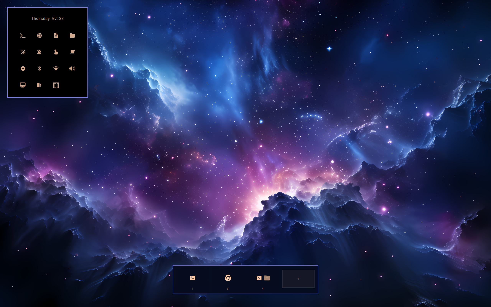

# 🗣️ Speaker Corners

> Hot corners that react. One lightweight, fully click-through Omarchy plugin.




---

## 🎯 The corners

Dwell on a corner and it fires — everything else stays fully click-through.

| Corner | Name | Default | What it does |
| ------ | ---- | ------- | ------------ |
| bottom-right | **Expose** | live expose | Spreads the *real* windows of the focused workspace into a gap grid — all visible, none overlapping, aspect kept, never upscaled. Nothing is screenshotted: entering and leaving is a single `hyprctl --batch`, so there is no preview layer to burn CPU. The window under the cursor gets a 50% tint shaped like its own rounded corners; click it to restore every original geometry and bring it to the front. Empty click, `Esc` or dwelling the corner again restores everything. If the shell dies mid-spread, the originals are parked in `~/.local/state/omarchy/speakercorners-expose.json` and put back on next start. |
| bottom-left | **Zen** | hide chrome | Hides the menu bar and workspace strip for a clean, focused desktop; dwelling again brings everything back. |
| top-left | **Cascade** | cascade floats | Floats every window of the active workspace and lays them out as a diagonal cascade (700×500, sliding right-and-down), so each one keeps a visible sliver. Idempotent — re-dwelling just re-runs it. |
| top-right | **Arrange** | window modes | Converts the active workspace by majority: all floating → tiled, all tiled → floating; mixed workspaces follow the majority. When tiling, a fullscreen window is pulled back out so the split genuinely divides the screen. |
| bottom-center | **Overview** | workspace strip | Summons the workspace strip / smart app grid — which live in the separate [nagualstrip](https://github.com/nagualcode/omarchy-nagualstrip) plugin. Speaker Corners drives it over IPC (`omarchy-shell workspace-overview toggle`); with only this plugin installed the corner is just a rebindable command. |

Any corner can also be triggered over IPC: `omarchy-shell speakercorners triggeraction <name>`.

## 🧊 Icon panel

The float-bar (beside the clock, bottom-left) packs a nerd-friendly command center:
live indicators (night light, DND, reminders, stay-awake, screen recording),
Wi-Fi / Bluetooth / battery widgets, browser / terminal / text / folder
launchers through the `uwsm` session, a **draggable grid** you persist to
`shell.json`, and a show/hide toggle for the menu bar.

---

## 📦 Install

```sh
omarchy plugin add https://github.com/nagualcode/omarchy-speakercorners.git --enable
# optional — powers the Overview corner (workspace strip + app grid)
omarchy plugin add https://github.com/nagualcode/omarchy-nagualstrip.git --enable
omarchy restart shell
```

## 🗑️ Uninstall

```sh
omarchy plugin remove nagualcode.speakercorners
omarchy restart shell
```

> **Migration from v1:** the workspace strip, its settings popup and the smart
> app grid moved out of Speaker Corners 2.0 into
> [nagualstrip](https://github.com/nagualcode/omarchy-nagualstrip); the legacy
> `omarchy-shell workspace-overview toggle` and `speakercorners-apps` targets
> still work there.

---

## ⚙️ Configuration

Settings live in a `plugins` entry in `~/.config/omarchy/shell.json`
(`"id": "speakercorners"`). Every key is optional — the minimum entry is just
`{ "id": "speakercorners" }`:

```jsonc
{
  "id": "speakercorners",
  "enabled": true,
  "dwellMs": 139,          // how long the pointer must rest to fire (120–3000)
  "targetSize": 8,         // hot-corner hitbox, in px
  "animations": true,      // false to disable the icon-panel slide
  "clockFormat": "dddd HH:mm",
  "cardWidth": "auto",     // or a fixed px width
  "topLeftAction": "cascade-floats",
  "topLeftCommand": "",
  "topRightAction": "toggle-window-modes",
  "topRightCommand": "",
  "bottomLeftAction": "toggle-hide-chrome",
  "bottomLeftCommand": "",
  "bottomRightAction": "mirador",
  "bottomRightCommand": "",
  "bottomCenterAction": "command",
  "bottomCenterCommand": "omarchy-shell workspace-overview toggle"
}
```

### Corner actions

| Key | values |
| --- | ------ |
| `topLeftAction` | `command` / `cascade-floats` / `toggle-window-modes` / `none` |
| `topRightAction` | `command` / `toggle-window-modes` / `none` |
| `bottomLeftAction` | `command` / `toggle-hide-chrome` / `none` |
| `bottomRightAction` | `command` / `mirador` / `none` — the live expose |
| `bottomCenterAction` | `command` / `none` — `workspace-overview toggle` by default |

Each `*Command` runs via `bash -lc`, so `omarchy-*` helpers and your shell
niceties are all fair game.

---

## 🦾 Requirements

- **Omarchy** (shell + `omarchy-shell` IPC)
- **Hyprland** (native `WlrLayershell` + Hyprland IPC)
- A **Nerd Font** on the system (default: `JetBrainsMono Nerd Font`) for the
  advanced glyphs
- Optional: [nagualstrip](https://github.com/nagualcode/omarchy-nagualstrip)
  for the workspace strip / app grid the **Overview** corner drives

## 🧱 Roof tiles

- `Speakercorners.qml` — the whole single-surface overlay: hot corners, the
  icon panel and the live expose
- `IconModel.js` — app icon resolution (a faithful subset of Omarchy's HUD model)

## 🚗 License

MIT — go ahead, remix the corners. 🛹